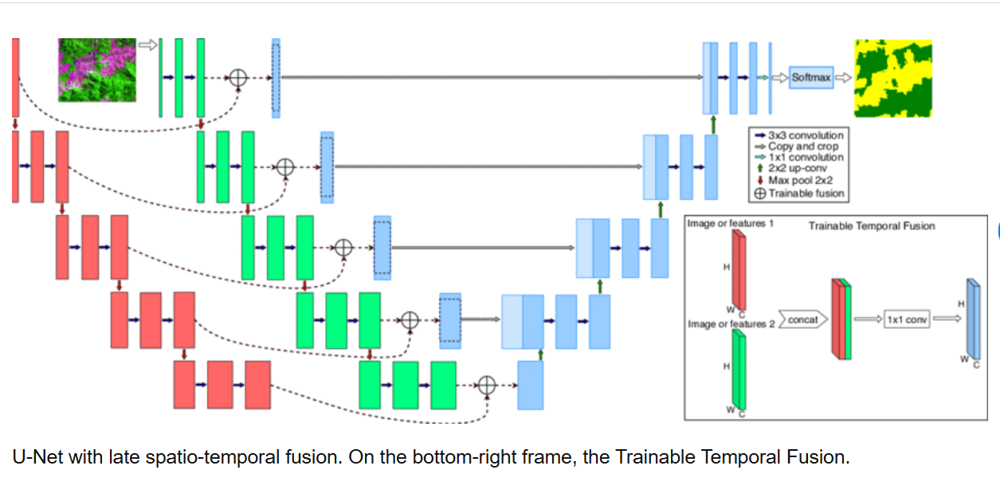

# 1. u-net link: https://www.geeksforgeeks.org/machine-learning/u-net-architecture-explained/
# 2. spacial unet link: https://www.researchgate.net/figure/U-Net-with-late-spatio-temporal-fusion-On-the-bottom-right-frame-the-Trainable-Temporal_fig1_340989612

=================================================================================================================================================================================
## U-Net架构的核心思想

你可以把U-Net想象成一个**“编码器-解码器”（Encoder-Decoder）结构，但它的特别之处在于它有一个“U”字形**的连接。

- **编码器（Encoder）**：这部分位于“U”的左侧。它就像一个传统的卷积神经网络（CNN），通过一系列的卷积层和池化层，逐步下采样（down-sample）图像。这个过程会不断地压缩图像的空间尺寸，同时增加其特征通道，目的是提取图像的高级语义信息。比如，在一个医疗图像中，编码器会识别出“这是肿瘤”、“这是血管”这样的高层特征。

- **解码器（Decoder）**：这部分位于“U”的右侧。它的任务是上采样（up-sample），逐步将编码器压缩后的特征图恢复到原始图像的尺寸。在这个过程中，它会利用这些高级特征来精确地定位分割目标，比如像素级的肿瘤边界。

- **跳跃连接（Skip Connections）**：这是U-Net最关键、最独特的设计，也是它名字“U”的由来。在编码器和解码器之间，U-Net会建立直接的连接，将编码器在不同下采样阶段的特征图直接传递给解码器对应的上采样阶段。

### 为什么跳跃连接如此重要？
跳跃连接解决了上采样过程中信息丢失的问题。

在编码器的下采样过程中，虽然我们提取了高级语义信息，但会损失掉很多空间细节（spatial details），比如物体的精确位置和边界。如果没有跳跃连接，解码器在恢复图像时，很难准确地重建这些细节。

通过跳跃连接，U-Net将编码器中保留的低层、高分辨率的细节信息（比如边缘、纹理）与解码器中提取的高层、低分辨率的语义信息（比如物体的类别）融合在一起。这使得模型在进行像素级的分类时，既能知道“这是什么”（高级语义），又能知道“它在哪里，边界在哪”（低级空间细节），从而得到非常精确的分割结果。

## U-Net的应用

U-Net最初是为了生物医学图像分割而设计的，因为它在处理这类图像时表现出色，可以精确地分割出细胞、血管或病变区域。但由于其高效的设计，它现在被广泛应用于：

- 医学图像分析（Medical Image Analysis）
- 卫星图像分析（Satellite Image Analysis）
- 缺陷检测（Defect Detection）
- 视频扩散生成（Video Diffusion Generation）

在视频扩散生成中，U-Net（通常是时空U-Net）的作用是作为去噪器。它接收一个充满噪声的图像或视频帧，并利用其强大的特征提取和恢复能力，预测出需要移除的噪声，逐步还原出清晰、连贯的视频。

=================================================================================================================================================================================

# U-Net Architecture Explained
Last Updated : 23 Jul, 2025

U-Net is a kind of neural network mainly used for image segmentation which means dividing an image into different parts to identify specific objects for example separating a tumor from healthy tissue in a medical scan. The name “U-Net” comes from the shape of its architecture which looks like the letter “U” when drawn. It is widely used in medical imaging because it performs well even with a small amount of labeled data.

## U-Net Architecture
The architecture is symmetric and has three key parts:

### Contracting Path (Encoder):

- Uses small filters (3×3 pixels) to scan the image and find features.
- Apply an activation function called ReLU to add non-linearity help the model to learn better.
- Uses max pooling (2×2 filters) to shrink the image size while keeping important information. This helps the network focus on bigger features.

### Bottleneck:

The middle of the “U” where the most compressed and abstract information is stored. It links the encoder and decoder.

### Expansive Path (Decoder):

- Uses upsampling i.e increasing image size to get back the original image size.
- Combines information from the encoder using “skip connections.” These connections help the decoder get spatial details that might have been lost when shrinking the image.
- Uses convolution layers again to clean up and refine the output.
  

The above image shows U-Net turning a 572×572 image into a smaller 388×388 segmented map. It shrinks the image to capture features then upsamples to restore size using skip connections to keep details. The output labels each pixel as object or background.

## How U-Net Works
After understanding the architecture, it’s important to see how U-Net actually processes data to perform segmentation:

- **Input Image**: The process starts by feeding a medical or other input image typically grayscale into the network.
- **Feature Extraction (Encoder)**: The encoder extracts increasingly abstract features by applying convolutions and downsampling. At each level the spatial size decreases while the number of feature channels increases and allow the model to capture higher-level patterns.

- **Bottleneck Processing**: This is the middle part of the network where the image is reduced the most. It holds a small but very meaningful version of the image that captures the main features.
- **Reconstruction and Localization (Decoder)**: The decoder begins to reconstruct the original image size through upsampling. At each level it combines decoder features with corresponding encoder features using skip connections to retain fine-grained spatial details.
- **Skip Connections for Precision**: Skip connections help preserve spatial accuracy by bringing forward detailed features from earlier layers. These are especially useful when the model needs to distinguish boundaries in segmentation tasks.
- **Final Prediction**: A 1×1 convolution at the end converts the refined feature maps into the final segmentation map where each pixel is classified into a specific class like foreground or background. This output has the same spatial resolution as the input image.

=====================================================================================================================================================================================================================

标准的U-Net架构通常处理的是单张图片。为了处理视频，研究者们对U-Net进行了关键性的修改，使其成为一个**“时空U-Net”（Spatio-Temporal U-Net）**。

这个“时空U-Net”不再仅仅是一个处理空间信息（即图片内容）的架构，它还额外加入了处理时间信息的能力。

确保视频一致性/时间连贯性的关键，主要依赖于以下两个核心机制：

### 1. 扩展输入：从单帧到多帧序列
首先，模型的输入就不同了。传统的U-Net输入是一张图片。而时空U-Net的输入是一整个视频片段，即一系列连续的图像帧（比如16帧、24帧等）。

模型将这个多帧序列（xₜ）作为一个整体来处理，而不是一帧一帧地单独处理。

### 2. 核心机制：时间注意力层（Temporal Attention）
这是确保时间连贯性的最关键技术。

在标准的U-Net中，所有的卷积层和注意力层都只关注单个图像内部的像素关系（空间关系）。

而在时空U-Net中，除了保留这些空间注意力层（Spatial Attention）外，研究者们在网络中插入了额外的时间注意力层（Temporal Attention）。

你可以这样理解它的工作原理：

- **空间注意力层**：负责处理每一帧内部的信息，比如识别出一只狗、一片草地，并确保狗的形状、草地的纹理是合理的。

- **时间注意力层**：负责在不同帧之间建立联系。当模型处理视频序列中的某一帧时，时间注意力机制会允许它“看”到同一位置在所有其他帧中的情况。

#### 举个例子：
如果视频中有一只鸟从左向右飞。

当模型去噪第5帧时，它通过空间注意力知道这一帧左边有一个模糊的鸟影。

同时，通过时间注意力，它会发现第4帧的鸟影在更靠左的位置，第6帧的鸟影在更靠右的位置。

通过这种跨帧的“观察”，模型能够学习到鸟的运动轨迹，从而确保它在去噪第5帧时，生成的鸟影不仅形状正确，而且位置也与前后帧的运动趋势保持一致，避免了鸟影突然闪烁或跳跃的情况。

因此，时空U-Net的输入是多帧序列，其内部通过空间注意力处理每一帧的视觉内容，再通过时间注意力处理帧与帧之间的运动关系。正是这种时空信息的协同处理，才保证了视频的连贯性。

=====================================================================================================================================================================================================================

# 2. spacial unet link: https://www.researchgate.net/figure/U-Net-with-late-spatio-temporal-fusion-On-the-bottom-right-frame-the-Trainable-Temporal_fig1_340989612
some pictures for u-net spatio

!(u-net_spatio_2.png)
