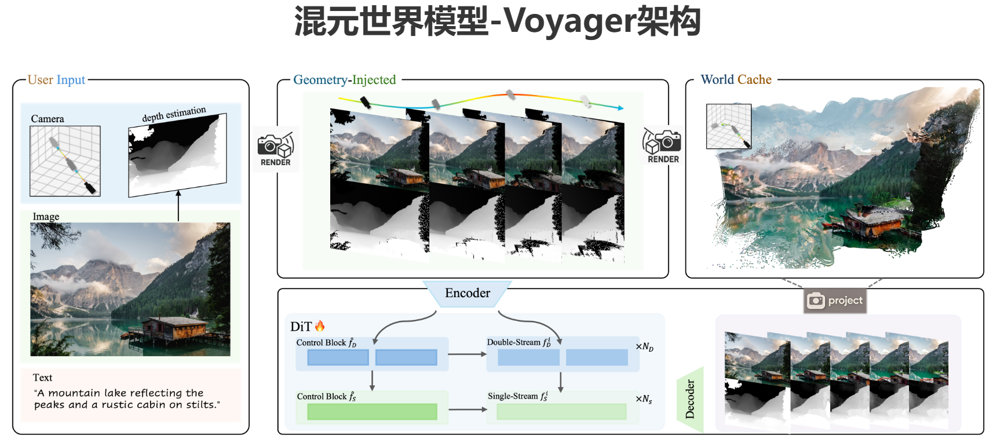

link: [混元世界模型-Voyager架构](https://3d-models.hunyuan.tencent.com/world/)
=================================================================================================================================================================================
要理解“拓展漫游3D场景的长距离、世界一致的视频扩散生成”，我们需要把这个复杂的概念拆解成几个核心部分。

### 1. 世界一致性 (World Consistency)
世界一致性是确保生成的视频内容在整个虚拟世界中都保持逻辑和物理上的正确性。简单来说，就是让视频中的所有元素（物体、光影、纹理等）都像在一个真实、稳定的三维空间里。

比如，当你在一个虚拟场景中漫游时，一个物体（如一棵树或一栋房子）从一个角度看是这样的，从另一个角度看也应该保持它的形状、大小和位置不变。如果光线从左边照过来，物体的影子就应该投射到右边。如果一个物体被遮挡了，它在被遮挡后重新出现时，也应该保持原样，而不是突然变形或消失。

总结来说，它意味着：
- **空间稳定性**：场景中的物体在整个视频中都保持固定的位置和形状，不会突然移动、闪烁或变形。
- **物理定律遵循**：光照、阴影、反射等物理效果在不同视角下都保持一致。
- **拓扑结构保持**：场景的整体布局和物体的相对位置是稳定的，不会出现前后矛盾的现象。

缺乏世界一致性的视频，看起来就像是把许多互不相干的图片拼凑在一起，会让人感到混乱和不真实。

### 2. 视频扩散生成 (Video Diffusion Generation)
视频扩散生成是一种利用扩散模型来生成视频的技术。

扩散模型是一种生成式人工智能模型。它通过一个“去噪”的过程来生成新的数据（比如图像或视频）。可以把它想象成一个艺术家，从一幅充满随机噪声（像电视雪花点）的画布开始，然后逐步“去除”这些噪声，直到最终形成一个清晰、逼真的图像或视频。

- **训练过程**：模型首先学习如何给真实视频添加噪声，直到视频完全变成噪声。
- **生成过程**：然后，它反过来学习如何从噪声中逐步恢复出原始视频。通过控制这个恢复过程，模型可以从纯噪声中生成全新的、符合特定描述（比如“森林中的小溪”）的视频。

视频扩散生成与传统的图像生成模型不同，它需要在时间维度上保持连续性。这意味着它不仅要确保每一帧画面看起来真实，还要确保帧与帧之间的过渡是平滑自然的，不会出现突然跳变的情况。

### 3. 漫游 (Traversal)
**“漫游”**指的是在3D场景中进行平滑、连续的视角移动，就像你在一个游戏或VR体验中自由行走一样。这与传统的视频生成不同，后者通常是固定视角或简单的平移、缩放。

漫游的特点是：
- **视角自由度高**：观众的视角可以随意改变，向前、向后、向上、向下，或者绕着一个物体旋转。
- **路径不确定性**：漫游的路径通常不是预设的，而是根据用户的输入或算法的自主探索来决定的。
- **长距离**：这里的“长距离”是关键，它意味着视频的长度可以很长，涵盖一个广阔的虚拟空间，而不仅仅是局限于一个很小的区域。

### 4. 长距离 (Long-distance)
在视频生成领域，“长距离”是一个重要的挑战。它指的是生成一个持续时间长、视角变化大的视频。

为什么这很难？
- **信息量巨大**：长视频需要模型持续地生成大量新内容，并且要保持前后一致。
- **记忆负担**：随着视频的推进，模型需要“记住”之前生成的所有内容，以确保新生成的场景与之前的场景在世界观上保持一致。这就像你画一幅长卷画，画到后面时，你必须记得前面画过的所有细节，并确保新加入的元素和前面的风格、结构保持统一。

### 综合理解
所以，“拓展漫游3D场景的长距离、世界一致的视频扩散生成”可以理解为：

利用先进的视频扩散模型，生成一个可以自由在广阔的3D场景中漫游的、长时间的视频。这个视频中的所有物体、光影和物理特性都必须保持高度的“世界一致性”，确保即使在长时间、大范围的视角变化下，场景的整体结构和细节仍然是稳定和可信的。

这个技术的目标是打破传统视频生成的限制，创造出更加沉浸式、互动性和真实感的虚拟体验。
好的，您的补充非常关键。这表明我们讨论的是混元世界模型（Hunyuan World）的特定架构——Voyager，而不是通用的混元大模型。在这个特定上下文中，world cache等的含义会更加具体，与3D场景和世界建模紧密相关。

### 理解混元世界模型 (Hunyuan World)
首先，混元世界模型 (Hunyuan World) 是一个专门为生成3D世界而设计的大型模型。它将生成式AI的能力从平面图像、视频扩展到了三维空间，旨在创造一个具有世界一致性和可交互性的虚拟环境。它不像传统的视频模型那样只生成一系列像素帧，而是生成一个包含几何、纹理、光照等信息的3D世界。

### Voyager 架构：输入与输出
在Voyager架构中，输入和输出都与3D世界的构建过程密切相关。我们来详细拆解一下：

#### 输入 (Input)
这里的输入不仅仅是简单的文本提示词。为了构建一个完整的、可漫游的3D世界，Voyager架构的输入通常包括：

- **文本提示词 (Text Prompt)**：基础的指令，比如“生成一个广阔的、充满奇幻森林和蜿蜒河流的世界”。

- **世界缓存 (World Cache)**：这就是我们讨论的核心。与文本模型中的词语缓存不同，这里的世界缓存是一个3D世界的“记忆”。它存储了模型已经生成过的几何结构、纹理信息、光照数据和物体位置。
  - **作用**：当模型需要继续生成新的区域（比如从森林走到山脉），它会从世界缓存中加载已有的信息。这确保了新生成的山脉与已有的森林在光照、风格、地形过渡上是一致的，避免了世界观上的分裂。
  - **举例**：如果模型已经生成了一个带有特定光影效果的湖泊，当它接下来生成湖泊周围的岸边时，会从缓存中读取湖泊的光照信息，确保岸边的光影与湖泊保持连贯。

- **等 (...)**：在Voyager架构中，这里的“等”可能代表其他几种关键的输入类型：
  - **用户交互信息**：比如用户在虚拟世界中移动的轨迹、交互的动作（如点击某个物体）。这些信息指导模型下一步应该生成什么。
  - **历史帧或视角信息**：就像视频生成需要记住前一帧一样，Voyager需要知道当前用户的视角和位置，才能准确地生成下一部分的3D世界。
  - **世界参数**：一些全局设置，如世界风格（写实、卡通）、昼夜时间、天气状况等。

#### 输出 (Output)
Voyager架构的输出也与3D世界生成相对应，通常包括：

- **新的世界部分 (New World Chunk)**：这是核心输出，指的是模型根据输入信息新生成的3D数据。它可能是一片新的地形、一座建筑、一个角色或一些植被。

- **更新后的世界缓存 (Updated World Cache)**：这是一个非常重要的步骤。模型将新生成的3D数据整合到旧的世界缓存中，形成一个更大的、更完整的“记忆库”。这个更新后的缓存将作为下一次生成循环的输入，以实现长距离、世界一致的漫游。

- **等 (...)**：这里的“等”可能代表其他输出，如：
  - **渲染图像 (Rendered Images)**：将生成的3D数据渲染成2D图像，供用户在屏幕上观看。
  - **控制信号**：用于驱动虚拟世界中角色的行动或物体的动态。

### 总结
在混元世界模型-Voyager架构中：

- **输入：世界缓存，等** 意味着模型接收一个包含已生成3D世界信息的缓存，以及用户的交互、提示词等其他指令。
- **输出：更新后的世界缓存，等** 意味着模型生成新的3D世界部分，并用这些新数据更新其内部的世界缓存，以确保整个虚拟世界的连贯性，并为下一次生成做准备。

这种设计使得模型能够像**“实时构建者”一样工作，根据用户的漫游路径动态、高效地生成一个无限且一致**的3D虚拟世界。
=================================================================================================================================================================================
## Camera depth estimation (相机深度估计)

Camera depth estimation (相机深度估计)是计算机视觉领域的一个重要概念，指的是从2D图像或视频中，推断出场景中每个像素点到相机的距离。

简单来说，就是让计算机像人眼一样，感知物体的远近。

### 为什么说它是一个输入？
在生成3D世界或视频时，相机深度估计常常被作为输入，来帮助模型理解场景的空间结构。

想象一下，你有一张照片，照片里有近处的花、中等的树和远处的山。如果模型只看到像素颜色，它并不知道哪些是近景，哪些是远景。

当你把深度图（depth map）作为额外的输入时，模型就获得了至关重要的空间信息。深度图上，每一个像素的值代表了它距离相机的距离。通常，近处的像素值较小（颜色较深），远处的像素值较大（颜色较浅）。

### 深度信息的作用
有了这个深度信息，模型在生成视频或3D场景时，就可以：

- **保持世界一致性**：确保近处的物体看起来大，远处的物体看起来小，并且它们之间的相对位置关系是正确的。
- **生成更真实的运动**：在相机移动时，近处的物体移动得快，远处的物体移动得慢，这符合人眼观察到的视差（parallax）现象。
- **重建3D场景**：深度信息是重建3D空间结构的基础。模型可以根据深度图，推断出物体的形状、高度和相互遮挡关系，从而生成一个真正具备三维属性的虚拟世界。

总之，camera depth estimation在视频生成和3D世界建模中，扮演着为模型提供**“深度感知”**的关键角色，让生成的虚拟内容更具真实感和空间感。
=================================================================================================================================================================================
